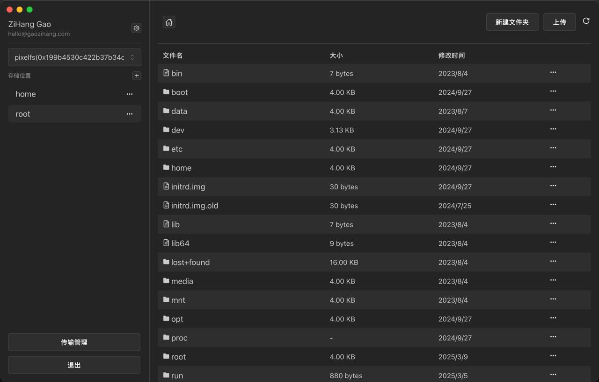

  

# pixelfs

`PixelFS` is a cross-device file management system that simplifies file transfer and management across multiple devices using the `s3-protocol`.

### Download

<https://github.com/pixelfs/pixelfs-desktop/releases>

