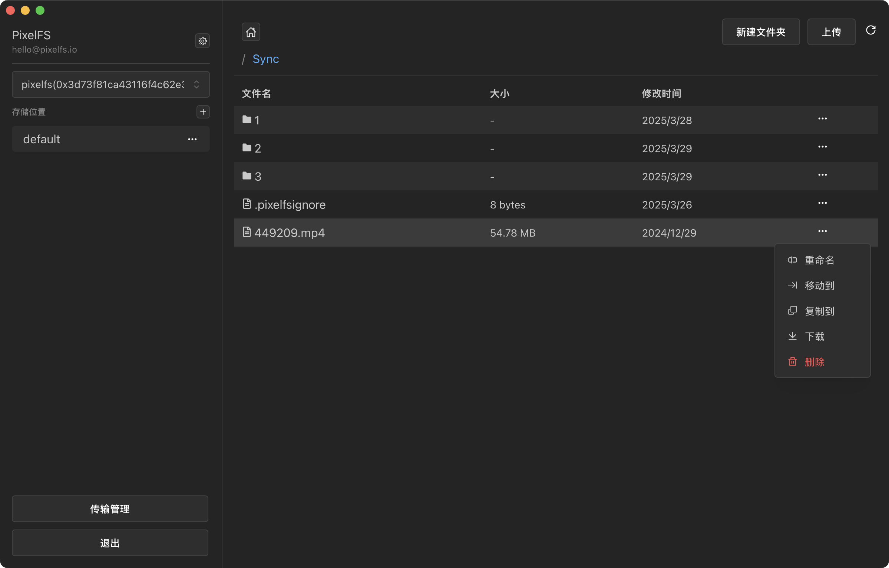
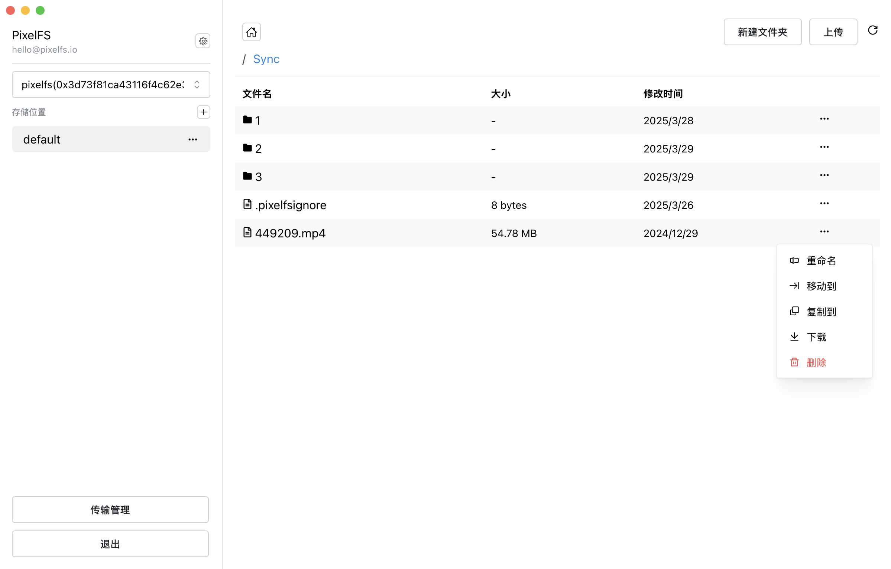
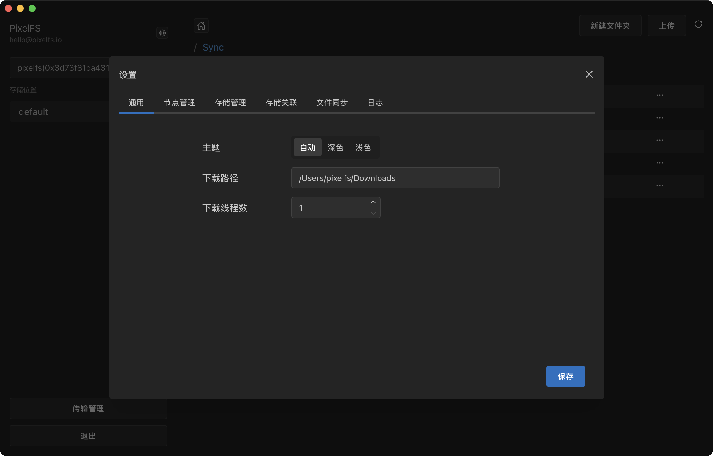
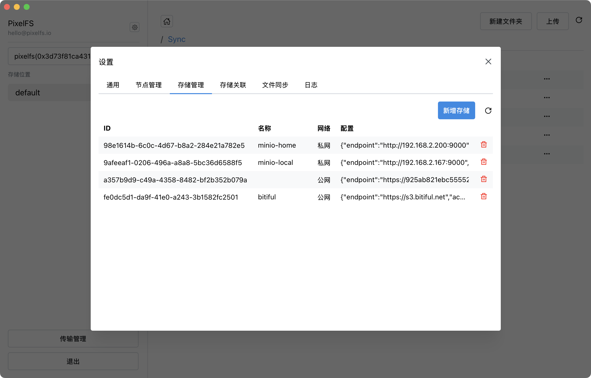
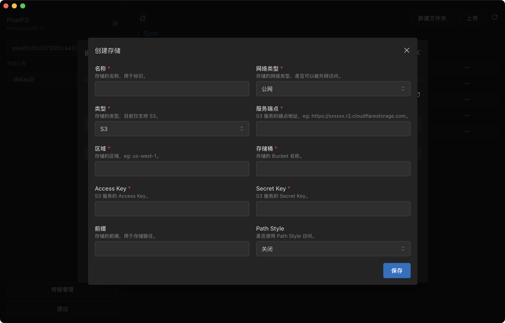
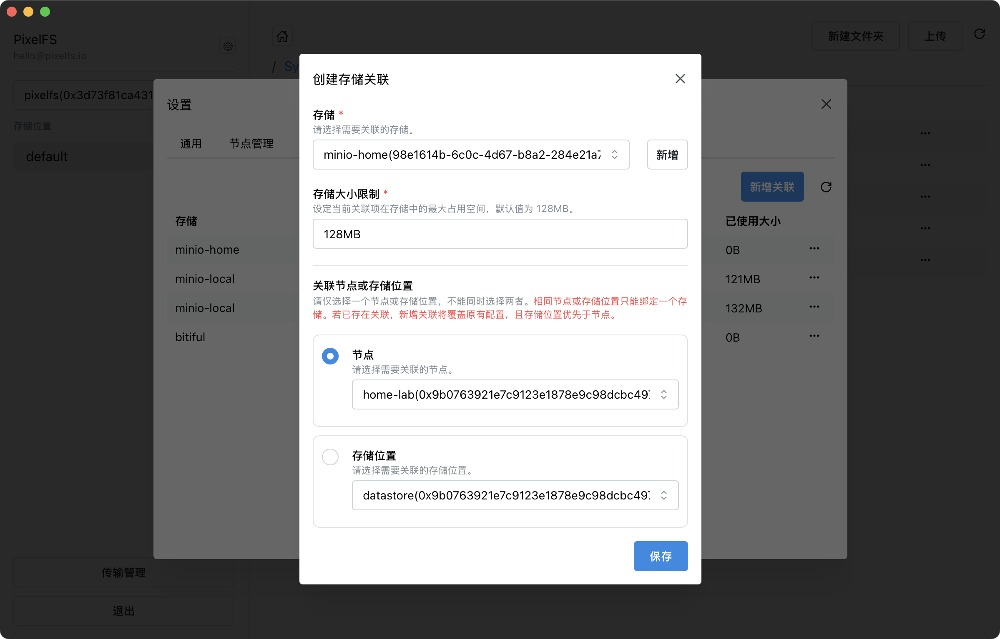
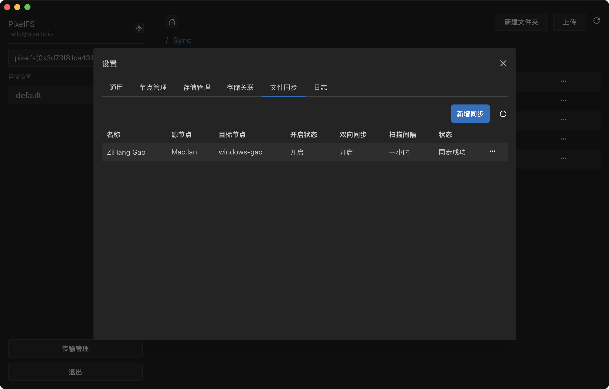
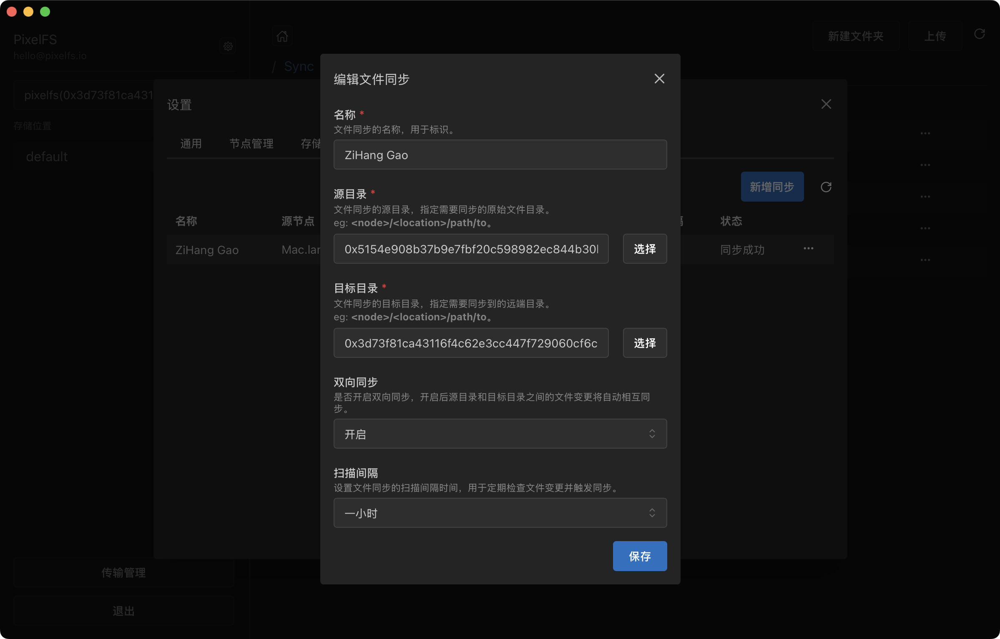

<p style="" align="center">
  
</p>

# pixelfs

[](LICENSE)
[](https://github.com/pixelfs/pixelfs-desktop/releases)

`PixelFS` is a cross-device file management system that simplifies file transfer and management across multiple devices using the `s3-protocol`.

## Installation

Available to download for free from <https://github.com/pixelfs/pixelfs-desktop/releases>




<details>
<summary>More Screenshots</summary>







</details>

## Build Guidelines

### Prerequisites

- Go (latest version)
- Node.js >= 20
- PNPM >= 9

### Install Wails

```bash
go install github.com/wailsapp/wails/v3/cmd/wails3@latest
```

### Pull the Code

```bash
git clone https://github.com/pixelfs/pixelfs-desktop.git
```

### Compile and Run

```bash
wails3 dev
```
